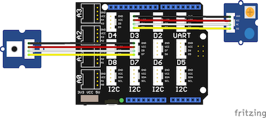

# Grove Button / Touch Sensor Demo

This simple demo controls a Grove LED from both a Grove Button and a web
application.

It doubles as a Grove Touch Sensor demo. To use with the touch sensor, simply
swap one in for the button. 

It also doubles as a Grove Relay demo. Just swap the LED module with a Relay
module.

## Requirements

* Esquilo Air
* Grove Base Shield
* Grove Button or Touch Sensor module
* Grove LED Socket or Relay module
* LED of your choice 
* Two Grove cables

## Running the Demo

### Connect the Grove Base Shield

Disconnect power from your Esquilo and carefully insert the Grove Base Shield.

### Set Grove Base Shield VCC switch to 5V

Slide the VCC switch on the Grove Base Shield to 5V. This will supply 5V to the
LED to make it bright.

### Connect Grove Button or Touch Sensor to D7

Use a Grove Cable to connect the Grove Button or Touch Sensor module to the Base
Shield's digital port 7 (D7).

### Insert LED

Insert the LED into the Grove LED module socket. The longer pin goes into the
hole marked wiht a '+'.

### Connect Grove LED or Relay to D3

Use a Grove Cable to connect the Grove LED or Relay module to the Base Shield's
digital port 3 (D3).

### Run button.nut

Connect power to your Esquilo and run the *button.nut* code.

You can do this using a link on the demo web app (next step) or from the
[Esquilo IDE](/).

### Open the Demo Web Application

[Button Demo Web App >](button.html)

### Press the Grove Button!

When you press the button (or touch sensor) the Grove LED and the web app's
background will both light up. Use the Virtual Button in the web app to simulate
presses.

If you swap the Relay module in for the LED, it will clack open and closed with
button presses.

Note: If the LED is dim or isn't lighting up, trying adjusting the module's
on-board brightness dial.
