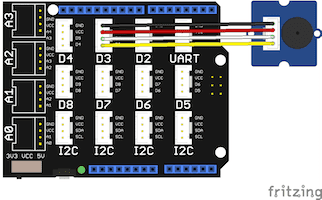

# Grove Buzzer Demo

This demo lets you play simple songs from a web app.

## Requirements

* Esquilo Air
* Grove Base Shield
* Grove Buzzer
* Grove cable

## Running the Demo

### Connect the Grove Base Shield

Disconnect power from your Esquilo and carefully insert the Grove Base Shield.

### Set Grove Base Shield VCC switch desired level

Slide the VCC switch on the Grove Base Shield to 5V for a louder tone.

### Connect Grove Buzzer to D3

Use a Grove Cable to connect the Grove Buzzer module to the Base Shield's
digital port 3 (D3).

### Run buzzer.nut

Connect power to your Esquilo and run the *buzzer.nut* code.

You can do this using a link on the demo web app (next step) or from the
[Esquilo IDE](/).

### Open the Demo Web Application

[Buzzer Demo Web App >](buzzer.html)

### Play some music!

Select a song from the drop down and press play. You can also experiment with
changing some of the notes and the tempo.

