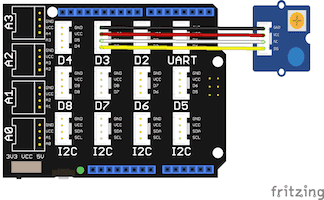

# Grove LED Socket Demo

This demo pulses an LED with a breathing effect. The speed can be controlled
remotely with the demo web app.

## Requirements

* Esquilo Air
* Grove Base Shield
* Grove LED Socket module
* LED of your choice 
* Grove cable

## Running the Demo

### Connect the Grove Base Shield

Disconnect power from your Esquilo and carefully insert the Grove Base Shield.

### Set Grove Base Shield VCC switch to 5V

Slide the VCC switch on the Grove Base Shield to 5V. This will supply 5V to the
LED to make it bright.

### Insert LED

Insert the LED into the Grove LED module socket. The longer pin goes into the
hole marked with a '+'.

### Connect Grove LED to D3

Use a Grove Cable to connect the Grove LED module to the Base Shield's digital
port 3 (D3).

### Run led.nut

Connect power to your Esquilo and run the *led.nut* code.

You can do this using a link on the demo web app (next step) or from the
[Esquilo IDE](/).

Note: If the LED is dim or isn't lighting up, trying adjusting the module's
onboard brightness dial.

### Open the Demo Web Application

[LED Demo Web App >](led.html)

### Change the Speed

Use the slider in the web app to control the pulse speed. 
