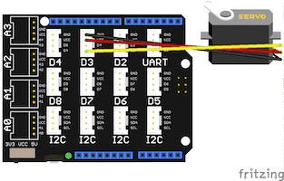

# Grove Servo Demo

This demo controls a servo from a web page slider.

## Requirements

* Esquilo Air
* Grove Base Shield
* Grove Servo

## Running the Demo

### Connect the Grove Base Shield

Disconnect power from your Esquilo and carefully insert the Grove Base Shield.

### Set Grove Base Shield VCC switch to 5V

Slide the VCC switch on the Grove Base Shield to 5V.

### Run servo.nut

Connect power to your Esquilo and run the *servo.nut* code.

You can do this using a link on the demo web app (next step) or from the
[Esquilo IDE](/).

### Open the Demo Web Application

[Servo Demo Web App >](servo.html)

### Control the Servo

Use the slider in the web app to change the servo position.
