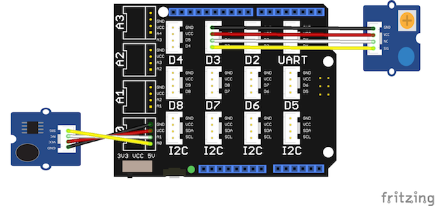

# Grove Sound Sensor Demo

This demo flashes an LED when a sound is detected with the Grove Sound Sensor
module.

## Requirements

* Esquilo Air
* Grove Base Shield
* Grove Sound Sensor module
* Grove LED Socket module
* LED of your choice 
* Two Grove cables

## Running the Demo

### Connect the Grove Base Shield

Disconnect power from your Esquilo and carefully insert the Grove Base Shield.

### Set Grove Base Shield VCC switch to 3.3V

Slide the VCC switch on the Grove Base Shield to 3.3V (because the Esquilo
analog-to-digital converter (ADC) uses a 3.3V reference).

### Connect Grove Sound Sensor to A0

Use a Grove Cable to connect the Grove Sound Sensor module to the Base Shield's
analog port 0 (A0).

### Insert LED

Insert the LED into the Grove LED module socket. The longer pin goes into the
hole marked with a '+'.

### Connect Grove LED to D3

Use a Grove Cable to connect the Grove LED module to the Base Shield's digital
port 3 (D3).

### Run soundSensor.nut

Connect power to your Esquilo and run the *soundSensor.nut* code.

You can do this using a link on the demo web app (next step) or from the
[Esquilo IDE](/).

Note: If the LED is dim or isn't lighting up, trying adjusting the module's
onboard brightness dial.

### Open the Demo Web Application

[Sound Sensor Demo Web App >](soundSensor.html)

### Make Some Noise

Make some noise and watch the LED's response. 
