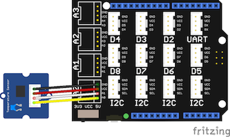

# Grove Temperature Sensor Demo

This demo displays the temperature read from a Grove Temperature Sensor module.

## Requirements

* Esquilo Air
* Grove Base Shield
* Grove Temperature Sensor module
* Grove cable

## Running the Demo

### Connect the Grove Base Shield

Disconnect power from your Esquilo and carefully insert the Grove Base Shield.

### Set Grove Base Shield VCC switch to 3.3V

Slide the VCC switch on the Grove Base Shield to 3.3V (because the Esquilo
analog-to-digital converter (ADC) uses a 3.3V reference).

### Connect Grove Sound Sensor to A0

Use a Grove Cable to connect the Grove Sound Sensor module to the Base Shield's
analog port 0 (A0).

### Run temperatureSensor.nut

Connect power to your Esquilo and run the *temperatureSensor.nut* code.

You can do this using a link on the demo web app (next step) or from the
[Esquilo IDE](/).

### Open the Demo Web Application

[Temperature Sensor Demo Web App >](temperatureSensor.html)

### Check out the Temperature

The web app should be displaying the room temp in Fahrenheit.
